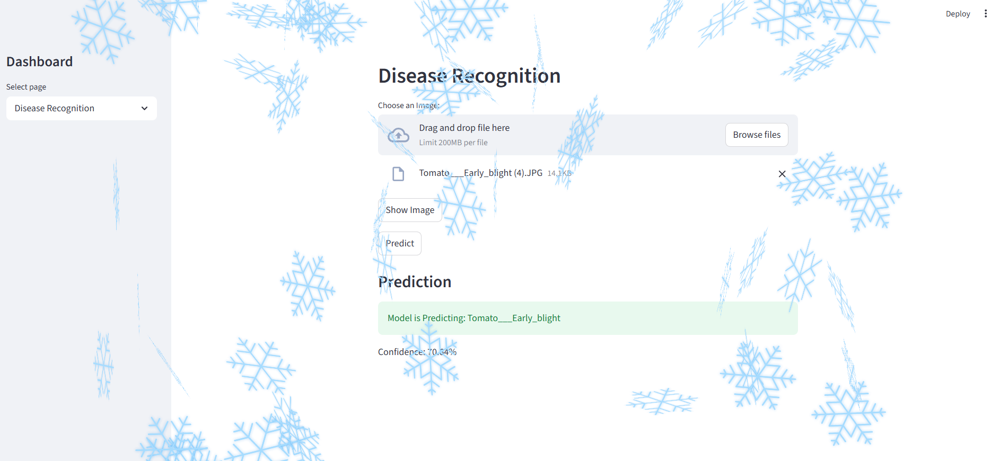
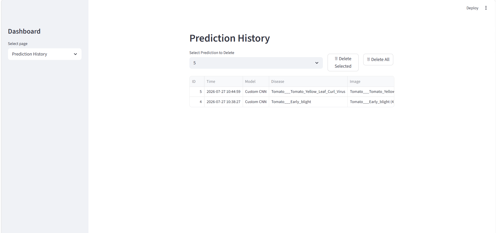

# 🌿 Plant Disease Recognition System

<p align="center">
  
</p>

<p align="center">
  <b>A Deep Learning-based Plant Disease Recognition System built with TensorFlow, FastAPI, Streamlit, Docker, and Hugging Face.</b>
</p>

<p align="center">


</p>

---

# 📖 Overview

The **Plant Disease Recognition System** is an end-to-end deep learning application that identifies plant diseases from leaf images using a Convolutional Neural Network (CNN).

The application follows a modular architecture consisting of:

- **TensorFlow/Keras** for deep learning inference
- **FastAPI** for serving REST APIs
- **Streamlit** for the user interface
- **SQLite** for prediction history
- **Docker** for containerized deployment
- **Hugging Face Hub** for automatic model distribution

The trained CNN classifies plant leaf images into **38 healthy and diseased classes** with an overall validation accuracy of approximately **92%**.

---

# ✨ Features

- 🌿 Classifies plant leaf images into **38 disease & healthy classes**
- 🧠 CNN model built using TensorFlow/Keras
- ⚡ FastAPI backend exposing REST APIs
- 🎨 Interactive Streamlit web interface
- 🐳 Dockerized deployment
- 🤗 Automatic model download from Hugging Face
- 💾 SQLite database for prediction history
- 📊 Displays prediction confidence
- 🗑️ Delete individual or all prediction history
- 📁 Modular project architecture

---

# 🏗 System Architecture

```text
                    User
                      │
                      ▼
             Streamlit Frontend
                      │
                HTTP REST API
                      │
                      ▼
              FastAPI Backend
                      │
       ┌──────────────┴──────────────┐
       ▼                             ▼
 Model Loader                 SQLite Database
       │                             │
       ▼                             │
 Hugging Face Hub (First Run)        │
       │                             │
       ▼                             │
 TensorFlow CNN Model                │
       └──────────────┬──────────────┘
                      ▼
               Prediction Result
```

---

# 🛠 Tech Stack

| Category | Technology |
|-----------|------------|
| Language | Python |
| Deep Learning | TensorFlow / Keras |
| Backend | FastAPI |
| Frontend | Streamlit |
| Database | SQLite |
| Containerization | Docker |
| Model Hosting | Hugging Face Hub |
| Image Processing | Pillow |

---

# 📂 Project Structure

```text
PlantDiseaseRecognitionSystem/
│
├── api/
├── assets/
├── backend/
├── config/
├── database/
├── docker/
├── frontend/
├── models/
├── requirements/
├── run.py
├── README.md
└── LICENSE
```

---

# 📊 Model Performance

| Metric | Value |
|---------|-------|
| Classes | 38 |
| Validation Accuracy | ~92% |
| Framework | TensorFlow / Keras |

---

# 📸 Application Screenshots

## 🏠 Home Page

<p align="center">

</p>

---

## 🔍 Disease Recognition

<p align="center">

</p>

---

## 📜 Prediction History

<p align="center">

</p>

---

# 🚀 Installation

Clone the repository

```bash
git clone https://github.com/NitinChourasiya/PlantDiseaseRecognitionSystem.git
```

Move into the project

```bash
cd PlantDiseaseRecognitionSystem
```

Run the application

```bash
docker compose -f docker/docker-compose.yml up --build
```

Open your browser

```
http://localhost:8501
```

---

# 🤗 Model Distribution

The trained TensorFlow model is **not stored inside the GitHub repository**.

Instead, it is hosted on **Hugging Face Hub**.

When the application starts for the first time:

1. FastAPI checks whether the model exists locally.
2. If unavailable, it downloads the model from Hugging Face.
3. The model is cached locally for future predictions.

This keeps the repository lightweight while avoiding repeated downloads.

---

# 📡 REST API

## Predict Disease

```
POST /predict
```

Accepts an uploaded leaf image and returns:

- Predicted disease
- Confidence score

---

## Prediction History

```
GET /history
```

Returns all stored predictions.

---

## Delete Prediction

```
DELETE /history/{id}
```

Deletes a single prediction.

---

## Delete All Predictions

```
DELETE /history
```

Deletes every stored prediction.

---

# 🔮 Future Improvements

- 🔐 User authentication
- 📱 Mobile application
- 📈 Model versioning
- 🔥 Grad-CAM visualization
- 📊 Analytics dashboard

---

# 👨‍💻 Author

**Nitin Chourasiya**

MCA (Data Science)  
National Institute of Technology Patna

GitHub:
https://github.com/NitinChourasiya

LinkedIn:
https://www.linkedin.com/in/nitin-chourasiya-990318298/

## ⭐ Support

If you found this project useful, consider giving it a ⭐ on GitHub.
